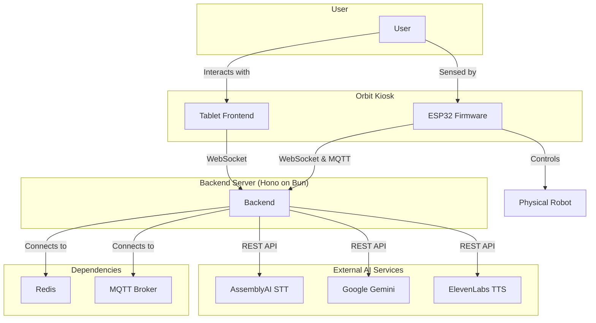

# Orbit Interactive Kiosk

<p align="center">
  
</p>

<p align="center">
  <strong>An interactive, AI-powered kiosk system for engaging user experiences.</strong>
</p>

<p align="center">
  <a href="#features">Features</a> •
  <a href="#architecture">Architecture</a> •
  <a href="#getting-started">Getting Started</a> •
  <a href="#technologies-used">Technologies</a> •
  <a href="#project-structure">Project Structure</a> •
  <a href="#contributing">Contributing</a>
</p>

---

## 🚀 Introduction

Orbit is an innovative, interactive kiosk system designed to create engaging and immersive user experiences in public spaces. It combines a sleek tablet interface with a physically responsive robot, all powered by a robust backend and cutting-edge AI technologies. Whether it's providing information, entertaining users with a photobooth, or simply greeting passersby, Orbit is built to capture attention and deliver memorable interactions.

This monorepo contains the entire Orbit ecosystem, including the backend server, the tablet frontend application, and the firmware for the ESP32 microcontroller that controls the physical robot.

## ✨ Features

- **Real-time, Responsive Interaction:** A WebSocket-based backend ensures low-latency communication between all components.
- **Voice-Activated AI Assistant:** Users can speak naturally to the kiosk to ask questions and receive intelligent, voice-based responses.
- **AI-Powered Services:**
  - **Speech-to-Text:** Powered by AssemblyAI for accurate transcriptions.
  - **Generative AI:** Utilizes Google Gemini for intelligent and context-aware conversations.
  - **Text-to-Speech:** Leverages ElevenLabs for natural-sounding voice responses.
- **Interactive 3D Interface:** The tablet frontend, built with React and React Three Fiber, features an animated 3D robot face that responds to user presence and interaction.
- **AI Photobooth:** A built-in photobooth allows users to take pictures and collaboratively edit them with AI.
- **User Presence Detection:** An ESP32-powered sensor system detects user presence and distance, allowing the kiosk to react intelligently to its environment.
- **Physical Robot Control:** The ESP32 firmware controls servo motors for physical movements, such as tilting the tablet and turning the robot's "head," creating a more lifelike and engaging experience.
- **Modern Tech Stack:** Built with TypeScript, Bun, Hono, React, and Vite for a fast, efficient, and scalable system.

## 🏗️ Architecture

The Orbit system is composed of three main components that work together to create a seamless user experience:



1. **Backend (`apps/backend`):**
    - A high-performance server built with **Hono** on **Bun**.
    - Manages all WebSocket connections for real-time communication.
    - Integrates with third-party AI services (AssemblyAI, Google Gemini, ElevenLabs).
    - Handles business logic, such as the voice query pipeline, photobooth sessions, and user presence events.
    - Uses **Redis** for session management and caching, and **MQTT** for IoT messaging.

2. **Tablet Frontend (`apps/tablet`):**
    - A modern Progressive Web App (PWA) built with **React**, **Vite**, and **TypeScript**.
    - Features a dynamic 3D UI using **React Three Fiber**.
    - Provides the main user interface for all features, including the AI assistant and photobooth.
    - Communicates with the backend via WebSockets to send user input and receive real-time updates.

3. **ESP32 Firmware (`apps/esp32-firmware`):**
    - An **Arduino** sketch for the ESP32 microcontroller.
    - Connects to the backend via a secure WebSocket connection.
    - Manages hardware components:
      - **PIR Sensor:** Detects user motion.
      - **Ultrasonic Sensor:** Measures user distance.
      - **Servo Motors:** Control the physical movement of the tablet and robot head.
    - Sends sensor data to the backend to trigger user presence events.

## 🚀 Getting Started

Follow these instructions to get the Orbit system up and running on your local machine.

### Prerequisites

- [Node.js](https://nodejs.org/) (v18 or higher)
- [Bun](https://bun.sh/) (v1.0 or higher)
- [Docker](https://www.docker.com/) and [Docker Compose](https://docs.docker.com/compose/) (for running dependencies like Redis and Mosquitto)
- [Arduino IDE](https://www.arduino.cc/en/software) or [PlatformIO](https://platformio.org/) for flashing the ESP32 firmware.

### Installation

1. **Clone the repository:**

    ```bash
    git clone https://github.com/UtkarshTheDev/orbit.git
    cd orbit
    ```

2. **Install dependencies:**
    This project uses Bun as the package manager.

    ```bash
    bun install
    ```

3. **Set up environment variables:**
    Each application has an `.env.example` file. Copy these to `.env` and fill in the required API keys and configuration values.

    ```bash
    cp apps/backend/.env.example apps/backend/.env
    cp apps/tablet/.env.example apps/tablet/.env
    ```

### Running the Application

1. **Start the development servers:**
    This command will start the backend server and the tablet frontend in development mode.

    ```bash
    bun dev
    ```

2. **Flash the ESP32 Firmware:**
    - Open `apps/esp32-firmware/robot_controller.ino` in the Arduino IDE.
    - Update the WiFi credentials and WebSocket server URL.
    - Flash the firmware to your ESP32 device.

3. **Access the application:**
    - **Tablet Frontend:** Open your browser and navigate to `http://localhost:5173` (or the port specified by Vite).
    - **Backend Server:** The backend will be running on `http://localhost:3000` (or the port specified in your `.env` file).

## 📂 Project Structure

This project is a monorepo managed by Turbo.

```
/
├── apps/
│   ├── backend/         # Hono backend server
│   ├── tablet/          # React frontend application
│   └── esp32-firmware/  # ESP32 controller firmware
├── packages/
│   └── ...              # Shared packages (e.g., UI components, configs)
├── turbo.json           # Turborepo configuration
└── package.json         # Root package.json
```

## 🛠️ Technologies Used

- **Backend:** Bun, Hono, TypeScript, AssemblyAI, Google Gemini, ElevenLabs, Redis, MQTT
- **Frontend:** React, Vite, TypeScript, React Three Fiber, Zustand, TanStack Router
- **Firmware:** C++/Arduino for ESP32
- **Monorepo:** Turborepo
- **Linting/Formatting:** Biome

## 🤝 Contributing

Contributions are welcome! Please feel free to submit a pull request or open an issue.

1. Fork the repository.
2. Create a new branch (`git checkout -b feature/your-feature`).
3. Make your changes.
4. Commit your changes (`git commit -m 'Add some feature'`).
5. Push to the branch (`git push origin feature/your-feature`).
6. Open a pull request.

## 📄 License

This project is licensed under the MIT License. See the [LICENSE](LICENSE) file for details.
